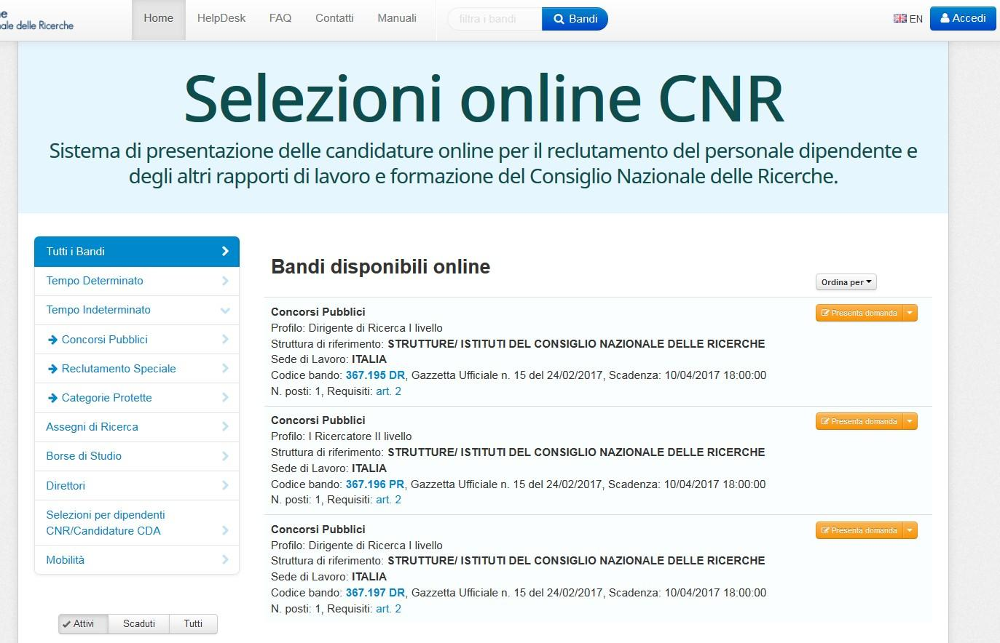

===========
Commissione
===========

I componenti della commissione dovranno utilizzare la procedura Selezioni Online, accessibile dalla
pagina https://selezionionline.cnr.it/, per poter visualizzare la documentazione presentata dai candidati.

Accesso / registrazione in procedura
====================================

Come prima cosa occorre accedere con le proprie credenziali.

.. figure:: images/commissione_3.jpg

Se non si dispone di credenziali di accesso procedere alla propria registrazione nel sistema, eventualmente consultando :doc:`Accesso e Registrazione<registrazione>`

Accesso alle domande
====================

Dopo aver effettuato l’accesso alla procedura, viene attivato un nuovo menù con il proprio nominativo
attraverso il quale è possibile visualizzare e/o modificare le proprie impostazioni personali ed è possibile
disconnettersi dall’applicazione:

Una volta effettuato l’accesso, utilizzando i parametri di ricerca forniti dalla procedura, è possibile individuare
il bando per il quale si è abilitati in qualità di commissario:

.. figure:: images/commissione_5.jpg

Ad esempio si può inserire parte del codice del bando oppure l’acronimo dell’Istituto o del Dipartimento ed
effettuare la ricerca utilizzando "Cerca bandi":
In base ai parametri utilizzati verranno visualizzati tutti i bandi che soddisfano i criteri impostati.
Individuato il bando di interesse, utilizzando il menu posto alla destra del bando, è possibile visualizzare gli
allegati associati al bando stesso e, solo per gli utenti abilitati a poterlo fare, si attiverà la voce di menù
"Domande" attraverso la quale il componente della commissione potrà visualizzare tutte le domande che
dovrà valutare.

.. figure:: images/commissione_6.jpg

Cliccando su "Domande", si attiverà una nuova pagina che visualizzerà l’elenco di tutte le domande da
esaminare ed, utilizzando il menù posto alla destra di ciascuna domanda, sarà possibile visualizzare e/o
stampare la domanda del candidato e tutti gli allegati alla domanda stessa.

.. figure:: images/commissione_7.jpg

Se si clicca su "Allegati vari" si accede all’intero contenuto dei documenti presentati dal candidato come di seguito illustrato:

.. figure:: images/commissione_8.jpg

E’ possibile anche utilizzare la funzione "Esporta domande definitive" che consente di estrarre tutta la
documentazione presentata dal candidato per un loro esame in modalità "off line" dall’applicazione; è altresì
possibile estrarre soltanto i file di stampa di tutte le domande di partecipazione pervenute per quel bando.

.. figure:: images/commissione_9.jpg

Inoltre è possibile selezionare la tipologia di allegati da estrarre:

.. image:: images/commissione_10.png

Premendo il tasto "Attive con allegati" la Commissione potrà scaricare sul proprio PC un file "ZIP" contenente
tutta la documentazione presentata dai candidati ammessi al concorso (non esclusi d’ufficio). Tale file è
organizzato in tante "cartelle" quanti sono i candidati, contraddistinte, con il nominativo di ognuno di loro.
Qualora le prove sono sufficienti o il bando specifico non prevede soglie o sbarramenti non si deve cliccare nulla.

Uscita dalla procedura
======================

Terminata la consultazione della documentazione necessaria, si raccomanda di uscire dalla procedura
Selezioni Online utilizzando dal menù la scelta "Esci"

