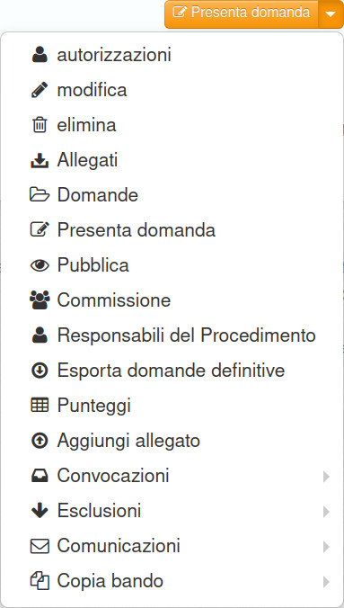
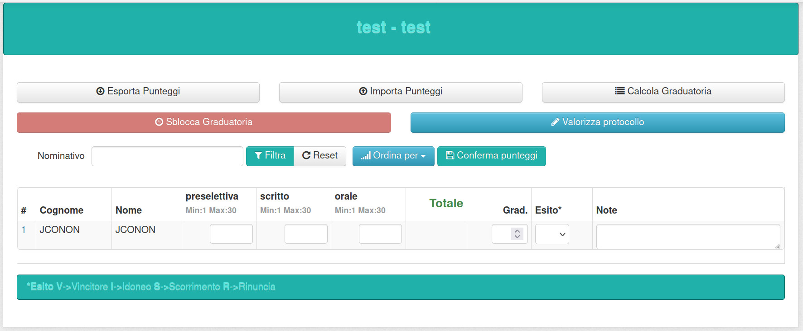
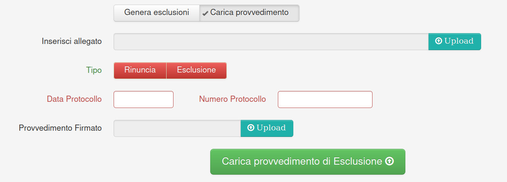

============================================
Gestione delle comunicazioni con i candidati
============================================

Jconon permette di inviare ai candidati 3 tipi di messaggi, Convocazioni, Esclusioni e Comunicazioni. Le modalità si invio sono comuni e prevedono la generazione del messaggio, la firma (passaggio di recente divenuto opzionale) e l'invio. Le voci relative alla generazione e l'invio delle tre tipologie si trova nel menu del bando:

-----------------------------------------
Generazione del messaggio di Convocazione
-----------------------------------------

Il messaggio si genera dal menu del bando, scegliendo "*Convocazioni*"->"*Genera*".
I campi testo obbligatori sono "**Data**" e "**Luogo**" della convocazione, inoltre è possibile selezionare i singoli destinatari, filtrando il campo "Domande".

E' prevista la possibilità di inserire un allegato e di valorizzare il campo firma presente nel testo del messaggio.
Il sistema genera un PDF per ogni candidato che può essere visualizzato, aggiornato, eliminato oppure modificato nella valorizzazione della data e del numero di protocollo.

.. figure:: images/Convocazione-form.jpg
   :width: 600

----------------------------------
Firma dei messaggi di Convocazione
----------------------------------

.. figure:: images/Convocazione-esempio.jpg
   :width: 600

Una volta generati i documenti PDF, il sistema si posiziona nella pagina dell'elenco dei messaggi, dove è possibile firmarli digitalmente (nella sola modalità PAdES), tramite l'utilizzo di una firma remota Aruba. Si veda la guida apposita per la configurazione corretta dei parametri. Cliccando "Firma convocazioni" si apre la maschera di inserimento delle credenziali e dell'OTP: il sistema firma massivamente le convocazioni.

----------------------------------
Invio dei messaggi di Convocazione
----------------------------------

Una volta firmate le convocazioni, si clicca "**Invia convocazioni**" e si inseriscono i parametri di login di un account PEC possibilmente dedicato ai concorsi (non mail ordinaria), e si sceglie a quale indirizzo inviare i messaggi. In questo passaggio si deve tenere presente che: 

 * se il candidato ha presentato un indirizzo PEC, il sistema provvede in autonomia a recuperare le ricevute di accettazione e di avvenuta consegna, mostrando a video la ricezione del messaggio verso il candidato.
 * se il candidato ha presentato un indirizzo mail ordinario, nel corpo del messaggio compare un testo dove si invita il candidato a cliccare un link per confermare l'avvenuta ricezione.

Il documento PDF viene depositato nello spazio personale del candidato e può essere sempre reperito dallo stesso entrando con le sue credenziali ed andando nella sezione "**Le mie domande**".

Qualora sia configurato un servizio nel sistema io.italia.it, viene inviata anche una notifica al Codice Fiscale presente nella domanda con il link alla convocazione nello spazio personale del candidato.

---------------------------------------
Generazione del messaggio di Esclusione
---------------------------------------
Questa sezione si utilizza dopo la valorizzazione dei voti nella sezione "Punteggi", di cui si riporta un esempio:

Il messaggio si genera dal menu del bando, scegliendo "*Esclusioni*"->"*Genera*". 
L'obiettivo di questa sezione è di agevolare la Commissione nel filtrare i destinatari delle esclusioni nelle varie prove. L'interfaccia infatti presenta la possibilità di selezionare le sole domande dichiarate non ammissibili, oppure quelle i cui candidati non abbiano superato una determinata prova, tra quelle inserite nella configurazione del bando alla `Sezione 4`_.

Nell'esempio sopra, il candidato "Jconon" ottiene un punteggio pari a 6 nella prova preselettiva ed il minimo per passare è 21. Nell'immagine si vede che il sistema filtra automaticamente la sua domanda. Questa funzione è utilizzabile per ogni prova. 

.. figure:: images/Esclusione-form.jpg
   :width: 600

E' possibile infine gestire anche il caricamento dei provvedimenti ad hoc, di *Rinuncia* o di *Esclusione*.

--------------------------------
Firma dei messaggi di Esclusione
--------------------------------

Una volta generati i documenti PDF, il sistema si posiziona nella pagina dell'elenco dei messaggi, dove è possibile firmarli digitalmente (nella sola modalità PAdES), tramite l'utilizzo di una firma remota Aruba. Si veda la guida apposita per la configurazione corretta dei parametri. Cliccando "Firma esclusioni" si apre la maschera di inserimento delle credenziali e dell'OTP: il sistema firma massivamente le convocazioni.

--------------------------------
Invio dei messaggi di Esclusione
--------------------------------

Una volta firmate le esclusioni, si clicca "**Invia esclusioni**" e si inseriscono i parametri di login di un account PEC possibilmente dedicato ai concorsi (non mail ordinaria), e si sceglie a quale indirizzo inviare i messaggi. In questo passaggio si deve tenere presente che: 

 * se il candidato ha presentato un indirizzo PEC, il sistema provvede in autonomia a recuperare le ricevute di accettazione e di avvenuta consegna, mostrando a video la ricezione del messaggio verso il candidato.
 * se il candidato ha presentato un indirizzo mail ordinario, nel corpo del messaggio compare un testo dove si invita il candidato a cliccare un link per confermare l'avvenuta ricezione.

Il documento PDF viene depositato nello spazio personale del candidato e può essere sempre reperito dallo stesso entrando con le sue credenziali ed andando nella sezione "**Le mie domande**".

Qualora sia configurato un servizio nel sistema io.italia.it, viene inviata anche una notifica al Codice Fiscale presente nella domanda con il link all'esclusione nello spazio personale del candidato.

------------------------------------------
Generazione del messaggio di Comunicazione
------------------------------------------
Questa sezione si utilizza dopo la valorizzazione dei voti nella sezione "Punteggi", a cui si rimanda.

Il messaggio si genera dal menu del bando, scegliendo "*Comunicazioni*"->"*Genera*". 
L'obiettivo di questa sezione è di agevolare la Commissione nel filtrare i destinatari delle comunicazioni di superamento delle varie prove. L'interfaccia infatti presenta la possibilità di selezionare i candidati che abbiano ottenuto un determinato range di punteggio, oppure le sole domande i cui candidati abbiano superato una determinata prova, sempre tra quelle inserite nella configurazione del bando alla Sezione 4.

.. figure:: images/Comunicazione-form.jpg
   :width: 600

-----------------------------------
Firma dei messaggi di Comunicazione
-----------------------------------

Una volta generati i documenti PDF, il sistema si posiziona nella pagina dell'elenco dei messaggi, dove è possibile firmarli digitalmente (nella sola modalità PAdES), tramite l'utilizzo di una firma remota Aruba. Si veda la guida apposita per la configurazione corretta dei parametri. Cliccando "Firma esclusioni" si apre la maschera di inserimento delle credenziali e dell'OTP: il sistema firma massivamente le convocazioni.

-----------------------------------
Invio dei messaggi di Comunicazione
-----------------------------------

Una volta firmate le comunicazioni, si clicca "**Invia comunicazioni**" e si inseriscono i parametri di login di un account PEC possibilmente dedicato ai concorsi (non mail ordinaria), e si sceglie a quale indirizzo inviare i messaggi. In questo passaggio si deve tenere presente che: 

 * se il candidato ha presentato un indirizzo PEC, il sistema provvede in autonomia a recuperare le ricevute di accettazione e di avvenuta consegna, mostrando a video la ricezione del messaggio verso il candidato.
 * se il candidato ha presentato un indirizzo mail ordinario, nel corpo del messaggio compare un testo dove si invita il candidato a cliccare un link per confermare l'avvenuta ricezione.

Il documento PDF viene depositato nello spazio personale del candidato e può essere sempre reperito dallo stesso entrando con le sue credenziali ed andando nella sezione "**Le mie domande**".

Qualora sia configurato un servizio nel sistema io.italia.it, viene inviata anche una notifica al Codice Fiscale presente nella domanda con il link alla comunicazione nello spazio personale del candidato.

.. _Sezione 4: https://github.com/consiglionazionaledellericerche/cool-jconon/blob/master/docs/configurazione_bandi.rst
