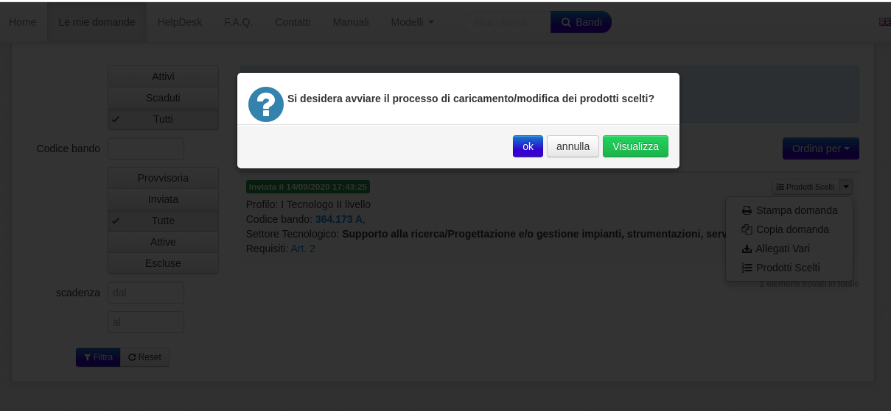
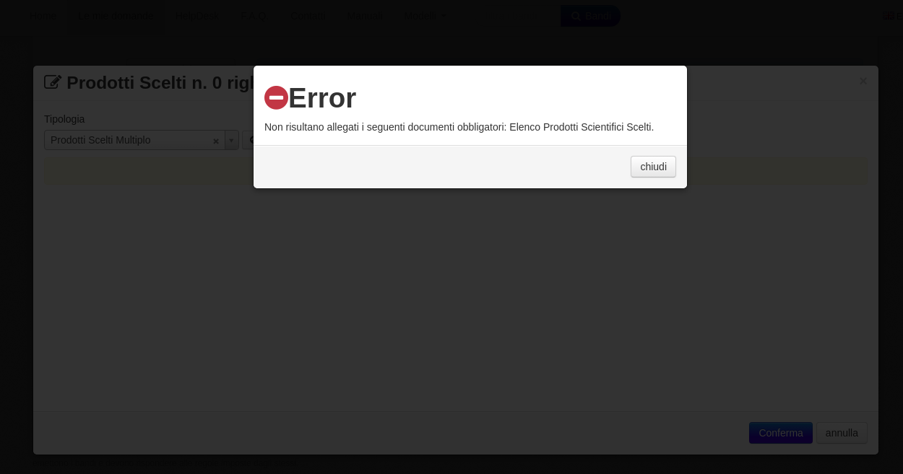

===============
Prodotti Scelti
===============
I candidati che hanno presentato domanda definitiva, successivamente alla pubblicazione dei criteri di valutazione dei titoli, dovranno dichiarare i titoli che intendono
sottoporre all’esame della Commissione come “prodotti scelti”, da individuare tra quelli già indicati nel proprio curriculum professionale.

.. figure:: images/prodotti_scelti_1.png

A tale scopo i candidati dovranno nuovamente accedere alla piattaforma selezioni online nella sezione "Le mie domande" ed inserire in procedura (allegando singolarmente i
relativi file in formato PdF) i prodotti scelti, intesi quali espressione della loro migliore produzione tecnico/scientifica e/o professionale.

.. figure:: images/prodotti_scelti_3.png

I candidati dovranno allegare, altresì, un elenco dei suddetti prodotti, avendo cura di indicare l’esatta denominazione degli stessi e la
corrispondente posizione numerica nell’ambito del curriculum professionale.

.. figure:: images/prodotti_scelti_4.png

Non saranno valutati i prodotti scelti non inseriti in procedura con le sopra indicate modalità.
La procedura informatica non consentirà l’inserimento di un numero di prodotti scelti superiori a quello indicato nel bando.

.. figure:: images/prodotti_scelti_6.png

A tutti i candidati sarà data comunicazione individuale, all’indirizzo di posta elettronica istituzionale, dell’avvenuta pubblicazione dei criteri di valutazione dei titoli.

Solo Elenco Titoli
==================
I candidati che hanno presentato domanda definitiva, successivamente alla pubblicazione dei criteri di valutazione dei titoli, potranno aggiornare l'elenco da
sottoporre all’esame della Commissione come “prodotti scelti”, da individuare tra quelli già presenti nella domanda.
A tale scopo i candidati dovranno nuovamente accedere alla piattaforma selezioni online nella sezione `Le mie domande <https://selezionionline.cnr.it/jconon/my-applications>`_
dove sarà presente una nuova voce "Elenco Prodotti Scelti" come mostrato in figura:

.. figure:: images/prodotti_scelti_lista_1.png

I candidati attraverso questa funzionalità potranno aggiornare anche più volte il proprio elenco fino alla scadenza prevista,
sarà preso in considerazione l'ultima versione caricata

.. figure:: images/prodotti_scelti_lista_2.png

La piattaforma non invia nessuna email di conferma, l'avvenuto caricamento potrà essere controllato attivando la "Sezione I"

.. figure:: images/prodotti_scelti_lista_3.png

dove è anche possibile verificare tutte le revisioni del file caricate nel tempo:

.. figure:: images/prodotti_scelti_lista_4.png
